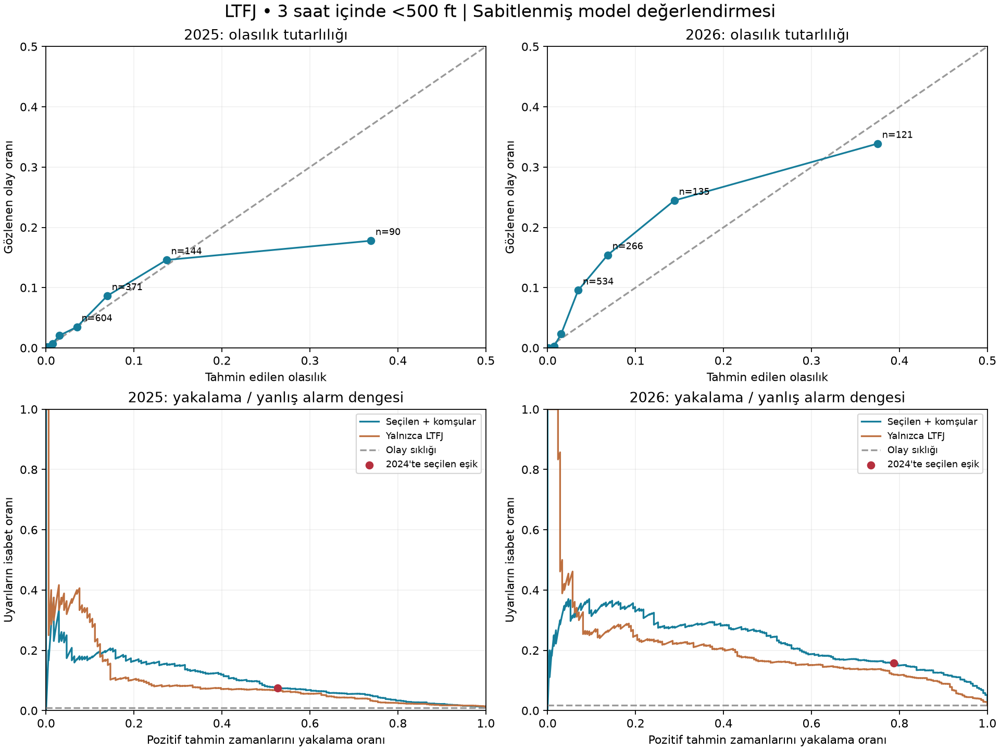

# İlk istatistiksel model: araştırma sürümü

**Sonuç:** Çok yıllı METAR/SPECI ve dört çevre istasyonla çalışan, üç saat içinde LTFJ tavanının 500 ft AGL altına düşme olasılığını üreten ilk model hazırdır. Modelde öngörü sinyali vardır; düşük yanlış alarm oranıyla otomatik uyarı vermeye hazır olduğu gösterilmemiştir.

## Veri ve kaynak birleştirmesi

- 1 Ocak 2021–20 Eylül 2026: **104.153 tekil LTFJ gözlem zamanı**.
- IEM rutin raporları ve NOAA GHCNh içindeki ham METAR/SPECI metinleri birleştirildi. **3.937 zaman yalnızca GHCNh'den** geldi. Bunların tümü SPECI olmak zorunda değildir; IEM'de eksik rutin raporlar da bulunur.
- LTBA, LTFM, LTBQ ve LTBR için toplam **356.309 çevre istasyon raporu** indirildi. Bu istasyonların temsil yeteneği iddia edilmedi; katkıları model karşılaştırmasında sınandı.
- 2026 GHCNh kaynağında ham mesaj biçimi ve rapor türü etiketlemesi değişiyor. METAR/SPECI öneki bulunmayan `LTFJ DDHHMMZ ...` mesajları da çözümlendi. Kaynağın FM16 sayısını doğrudan gerçek SPECI sayısı saymıyoruz.
- Kaynaklar bilinen bir alanın değerinde anlaşmıyorsa o alan belirsiz bırakıldı. İki zamanda kaynaklar `<500 ft` durumu üzerinde çelişti; bu gözlemler kesin hedef üretmekte kullanılmadı.
- NOAA'nın hazır sayısal tavan alanı hedef için kullanılmadı; özgün mesajdaki BKN/OVC/VV kodları esas alındı. TEMPO/BECMG ve açıklamalar gözlenen tavan sayılmadı.

Kaynak URL'leri, özetler, biçim sayımları ve çatışmalar [research-data-audit.json](research-data-audit.json) içindedir. Daha önceki IEM-only denetimler tarihsel karşılaştırma olarak korunur; model birleşik veriyle eğitildi.

## Önceden belirlenen deney

[research-protocol.json](../research-protocol.json), test sonuçları hesaplanmadan önce yazıldı.

| Bölüm | Dönem | Kullanım |
|---|---|---|
| Eğitim | 2021–2023 | Katsayılar, eksik değer doldurma ve ölçekleme; 51.854 uygun örnek |
| Doğrulama | 2024 | Düzenlileştirme/özellik grubu seçimi, olasılık düzeltmesi, deneme uyarı eşiği; 17.233 örnek |
| Geriye dönük değerlendirme | 2025 | Ayar değiştirmeden değerlendirme; 17.326 örnek |
| Zamansal değerlendirme | 1 Ocak–20 Eylül 2026 | Ayar değiştirmeden değerlendirme; 12.314 örnek |

Örnekler her yarım saatte bir üretilir. Eğitim ve doğrulama sınırında 24 saatlik tampon bulunur; hedef penceresinin de kesim zamanından önce bitmesi gerekir. Rastgele satır bölünmesi yapılmadı. Farklı dönemlerdeki hava olayı bağımsızlığı mutlak olarak kanıtlanmış değildir.

2025 zaten veri kalitesi için incelenmişti; tamamen dokunulmamış nihai test olarak sunulmaz. 2026 sonuçları seçim sabitlendikten sonra hesaplandı. Bu deney görüldükten sonra yeni model ayarları yapılırsa her iki dönem de artık araştırma geçmişinin parçasıdır; yeni sürüm için yeni ileriye dönük dönem gerekir.

## Model

L2 düzenlileştirmeli lojistik regresyon; LTFJ özellikleri ve komşu istasyon özellikleri olmak üzere iki grup, her biri için üç `C` değeri denendi. Seçim yalnızca 2024 Brier skoruna göre yapıldı. Seçilen model **LTFJ + komşular, C=0,01**.

Girdiler mevcut tavan durumu, sıcaklık–çiy noktası farkı, görüş, rüzgâr bileşenleri, basınç, sis/pus/yağış kodları, son 1–3 saatin değişimleri, geçmiş düşük tavan gözlemleri, saat/mevsim ve çevre istasyonların tavan/görüş/nem göstergeleridir. Eksik değer doldurma ve ölçekleme yalnızca eğitimde öğrenildi. Sınıf ağırlığı veya yapay çoğaltma uygulanmadı.

2024'te yalnızca sabit terimi değiştirerek ortalama olasılığı gözlenen oranla eşleştiren kalibrasyon yapıldı. Olasılık sıralaması değişmedi. Aynı doğrulama yılı model seçimi ve kalibrasyonda kullanıldığı için 2024 başarı sonuçları iyimser olabilir; esas yorum 2025/2026 üzerindedir.

Deneme alarm eşiği yaklaşık **%2,50**. Bu, 2024'te pozitif tahmin zamanlarının en az %70'ini yakalama koşuluyla seçildi. Kullanıcıya ait bir maliyet/operasyon kararı değildir; araştırma amacıyla sabitlenmiş örnek eşiktir.

## Test sonuçları

| Ölçüm | 2025 | 2026, 20 Eylül'e kadar |
|---|---:|---:|
| Pozitif tahmin zamanı | 171 | 211 |
| Olay sıklığı | %0,99 | %1,71 |
| Model ortalama olasılığı | %0,93 | %1,21 |
| Brier skoru (düşük iyi) | 0,009503 | 0,015126 |
| Eğitim olay sıklığı referansına göre Brier iyileşmesi | %2,75 | %10,46 |
| Average Precision (PR eğrisi özeti) | 0,103 | 0,231 |
| Pozitif tahmin zamanlarını yakalama | %52,6 | %78,7 |
| Uyarıların isabet oranı | %7,46 | %15,76 |
| Uyarıların yanlış çıkma oranı | **%92,54** | **%84,24** |
| Gerçek negatif zamanlarda yanlış uyarı oranı | %6,51 | %7,33 |

“Uyarıların yanlış çıkma oranı” ile “gerçek negatif zamanlarda yanlış uyarı oranı” farklı paydalara sahiptir. Birincisi yanlış uyarı / tüm uyarılar, ikincisi yanlış uyarı / tüm olaysız zamanlardır. Tablodaki uyarılar yarım saatlik tahmin zamanlarıdır; bağımsız bildirim/meteorolojik olay sayısı değildir.

Olay dizisi ölçümünde 2025'te 36 düşük tavan dizisinin 27'sinden, 2026'da 39 dizinin 37'sinden önce en az bir uygun uyarı bulunur. Bu yüksek oranlar yanlış alarm yükünü ortadan kaldırmaz ve birbirine yakın diziler bağımsız kabul edilmemelidir.

Sabit olay sıklığı, ay/saat sıklığı ve mevcut tavan grubu olmak üzere üç basit referans da değerlendirildi. Komşular 2024'te ve 2026'da Brier açısından katkı sağladı; 2025'te yalnızca LTFJ modeli biraz daha iyi Brier verdi. Bu nedenle komşu verinin katkısı her yıl aynı büyüklükte değildir. Test sonucuna bakıp model seçimi değiştirilmedi.

### Belirsizlik

500 tekrar, eşleştirilmiş yedi günlük blok yeniden örneklemesiyle Brier iyileşmesinin yaklaşık %95 aralığı:

- **2025: −%7,43 ile +%10,37** — bu yılda referansa üstünlük belirsiz.
- **2026: +%1,15 ile +%16,21** — bu dönemde olumlu kanıt var, yıllar arası kararlılık için yeterli değil.

Aralıklar sabitlenmiş modele ve indirilen arşive koşulludur; model seçimi, etiket hataları veya uzun dönem iklim/ölçüm değişikliklerinin tüm belirsizliğini kapsamaz.

Grafikteki kalibrasyon noktaları sabit olasılık aralıklarının ortalamalarıdır; `n` o aralıktaki tahmin zamanı sayısıdır. Noktalara bağımsız binom güven aralığı çizilmedi çünkü zaman örnekleri bağımlıdır. 2025'te yüksek olasılık grubunda fazla tahmin, 2026'da bazı gruplarda düşük tahmin görülüyor.

## Rapor gecikmesi

Arşivler gerçek geliş zamanı sağlamıyor. Ana deney, bir raporun gözlem zamanından **10 dakika sonra** kullanılabildiğini varsayar; bu ölçülmüş bir dağıtım gecikmesi değildir. Komşu veriler de aynı kesim zamanından seçilir.

Sabit modelle 0, 10 ve 20 dakikalık gecikme kontrolü yapıldı. 10 dakikada, zaten düşük tavan ve diğer dışlamalar dahil uygun tahmin kapsamı 2025'te yaklaşık %98,9, 2026'da %97,5. 20 dakikada mevcut 35 dakikalık tazelik kuralıyla kapsam sırasıyla **%2,0 ve %2,4'e** düşüyor. Kalan örnekler farklı olduğundan bu senaryoların başarı oranları doğrudan karşılaştırılamaz.

Bu modelin canlı kullanımında geç gelen rutin raporlar otomatik olarak “düşük risk” sonucuna çevrilmemeli. Veri tazeliği sağlanmıyorsa olasılık sunulmamalı. Gerçek zamanlı alım zamanlarını kaydeden ileriye dönük bir izleme seti gereklidir.

## Çalışan çıktı

- [model-parameters.json](model-parameters.json): taşınabilir katsayılar, eksik değer ve ölçekleme bilgisi; Python standart kütüphanesiyle tahmin üretilebilir.
- [model-results.json](model-results.json): tüm adaylar, referanslar, test ölçümleri ve blok belirsizliği.
- [model-diagnostics.json](model-diagnostics.json): sabit eşik karşılaştırmaları, kalibrasyon grupları, gecikme kontrolü.
- `models/ceiling-risk.joblib`: yerel eğitim nesnesi; Git'e alınmaz, yeniden üretilebilir.

Taşınabilir hesap, 1.034 farklı hazırlanmış satırda scikit-learn çıktısıyla karşılaştırıldı; en büyük mutlak fark yaklaşık `4,4e-16`. Birim testleri zaman sınırı, gecikme, kaynak çatışması, eksik veri, kalibrasyon ve alarm paydalarını kapsar.

## Bundan sonraki araştırma kararı

Bu sürüm araştırma amacıyla olasılık üretir. **Otomatik operasyonel alarm olarak yayımlanması uygun bulunmadı.** Teste bakarak eşiği yükseltip başarıyı yeniden ilan etmek yerine, yeni geliştirme sürümünde doğrulama döneminde belirlenmiş maliyet/yarar senaryoları ve yeni ileriye dönük test gerekir.

Ek meteorolojik veri için öncelik alt seviye nem/sıcaklık profili ve inversiyon bilgisidir. Sayısal tahmin kaynağının 2021–2023 eğitim dönemini, özgün çalıştırma zamanını ve yayımlanma gecikmesini kapsadığı doğrulanmadan modele eklenmemeli. Open-Meteo Single Runs dokümanındaki IFS HRES başlangıcı Mart 2024 olduğundan bu kaynak mevcut eğitim dönemini tek başına karşılamaz. ERA5'i gerçek zamanda bilinen veri gibi kullanmak bu sorunu çözmez. [Kaynak açıklaması](https://open-meteo.com/en/docs/single-runs-api).

Kaynak veri ve model değerlendirmesi açık olarak saklandı; yeni sürüm bu referansın üzerine, yeni protokolle kurulabilir.
